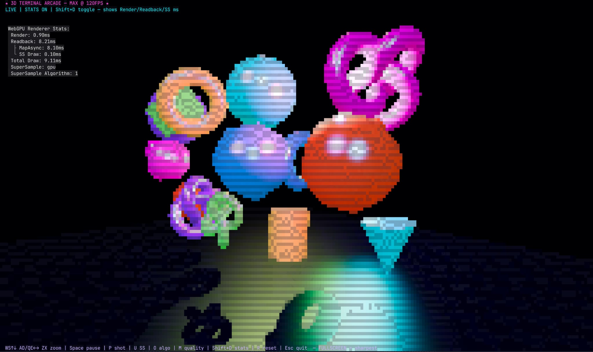

# 3D Terminal Arcade

> A neon 3×3 arcade wall rendered with **real Three.js geometry**, perspective projection, and WebGPU lighting — directly inside a terminal framebuffer via [OpenTUI](https://github.com/anomalyco/opencode).



`src/index.ts:58-139` builds a `THREE.Scene` with a perspective camera, 9 Phong-shaded meshes (TorusKnot, Dodecahedron, Torus, Box, Icosahedron), a checkerboard depth plane, and 4 lights (Ambient + 2 Directional + 1 orbiting PointLight). Everything is rasterized by `ThreeCliRenderer` into a `FrameBufferRenderable` at 60 FPS and converted to terminal glyphs. Yes, it's definitely 3D.

## Features

- **True 3D in the terminal** — `PerspectiveCamera` (`src/index.ts:62`) + depth, not ASCII tricks
- **WebGPU via `bun-webgpu`** — `ThreeCliRenderer.init()` awaited explicitly with fallback to `TextRenderable` on failure (`src/index.ts:181-192`)
- **9 animated objects** — 8 on a 3-row grid + 1 hero in center, each with distinct `MeshPhongMaterial` (shininess 110, white specular) (`src/index.ts:95-128`)
- **Live lighting** — warm/cool directional lights + magenta point light orbiting at `sin(elapsed)` (`src/index.ts:66-77`, `277`)
- **GPU supersampling** — cycle `GPU → CPU → OFF` with `U` (`SuperSampleType.GPU`, `src/index.ts:172-244`)
- **Responsive** — usable at 80×24, adapts to terminal resizes (`src/index.ts:256-264`)
- **PNG export** — captures the WebGPU scene _before_ glyph conversion (`src/index.ts:249-252`)

## Tech Stack

| Package          | Version   | Role                                                  |
| ---------------- | --------- | ----------------------------------------------------- |
| `three`          | `0.177.0` | Scene, camera, geometries, `MeshPhongMaterial`        |
| `@opentui/core`  | `^0.5.10` | `CliRenderer`, `FrameBufferRenderable`, input         |
| `@opentui/three` | `^0.5.10` | `ThreeCliRenderer`, `SuperSampleType`, `TextureUtils` |
| `bun-webgpu`     | `0.1.7`   | WebGPU binding for Bun                                |
| `jimp`           | `^1.6.0`  | PNG save via `engine.saveToFile()`                    |

## Requirements

- **Bun >= 1.3**
- **WebGPU-capable system** (macOS Metal, Windows DirectX 12, or Linux Vulkan)
- **True-color terminal** (Ghostty, Kitty, iTerm2, WezTerm, etc.)

> No WebGPU? The app shows a fallback message instead of a black screen (`src/index.ts:141-146`).

## Quick Start

```sh
bun install
bun run dev   # alias for bun src/index.ts
```

Other scripts:

```sh
bun run typecheck  # tsc --noEmit --skipLibCheck
bun run build      # typecheck + echo build ok
```

## Controls

| Key                   | Action                                           | Source                 |
| --------------------- | ------------------------------------------------ | ---------------------- |
| `W` / `S` / `↑` / `↓` | Move camera up / down                            | `src/index.ts:222-223` |
| `A` / `D` / `←` / `→` | Orbit yaw −/+ 0.18 rad (primary)                 | `src/index.ts:224-232` |
| `Q` / `E`             | Orbit yaw −/+ 0.12 rad (fine)                    | `src/index.ts:233-236` |
| `Z` / `X`             | Dolly in / out                                   | `src/index.ts:236-237` |
| `Space`               | Pause / resume animation                         | `src/index.ts:216-218` |
| `R`                   | Reset camera to `(0, 2, 6)`                      | `src/index.ts:238-241` |
| `U`                   | Cycle supersampling (GPU → CPU → OFF)            | `src/index.ts:242-244` |
| `Shift+D`             | Toggle WebGPU render stats                       | `src/index.ts:245-248` |
| `P`                   | Save PNG to `screenshots/arcade-<timestamp>.png` | `src/index.ts:249-252` |
| `Esc` / `Ctrl+C`      | Exit                                             | `src/index.ts:210-213` |

Status bar (`src/index.ts:153`) shows `LIVE / PAUSED | 9 OBJECTS | WEBGPU | <mode>` and controls are pinned to the bottom row.

## Screenshot

Press `P` while running. Output is written via `engine.saveToFile()` to the local `screenshots/` directory (gitignored). The PNG captures the raw WebGPU framebuffer — Phong highlights, depth, and lighting — before terminal glyph conversion.

## How It Works

```
CliRenderer (full-terminal, 60 FPS)
  ├─ TextRenderable: title / status / controls (zIndex 30)
  └─ FrameBufferRenderable (zIndex 10, full width/height)
       └─ ThreeCliRenderer.drawScene(scene, frameBuffer, delta)
            ├─ Scene: background #030014, 13×12 checkerboard floor
            ├─ Camera: PerspectiveCamera 60°, 0.1-100, at (0,2,6)
            ├─ Lights: Ambient(0.6) + Directional(warm/cool) + Point(magenta, orbiting)
            └─ Meshes: 9 × MeshPhongMaterial, auto-rotating + bobbing
```

- **Explicit engine path**: `new ThreeCliRenderer(...)` with `autoResize: false` and `focalLength: 8` (`src/index.ts:171-179`) — size is driven manually on resize for correct aspect (`camera.aspect = engine.aspectRatio`).
- **Animation loop**: `renderer.setFrameCallback` drives rotation (`0.18 + i*0.045` / `0.32 + i*0.06`), vertical bob (`sin(elapsed*1.2 + i) * 0.08`), point-light orbit, and auto-yaw (`0.055 rad/s`) (`src/index.ts:268-284`).
- **Cleanup**: `destroy()` disposes geometries/materials/textures and removes the framebuffer (`src/index.ts:289-300`).

## Project Structure

```
three-terminal-showcase/
├── src/index.ts        # All scene, renderer, input, and lifecycle logic
├── assets/demo.png     # Demo screenshot (used in this README)
├── screenshots/        # Runtime PNG exports (gitignored)
├── package.json        # Bun + WebGPU + Three.js deps
└── tsconfig.json       # ESNext / bundler / strict
```

## License

Private — not published.
