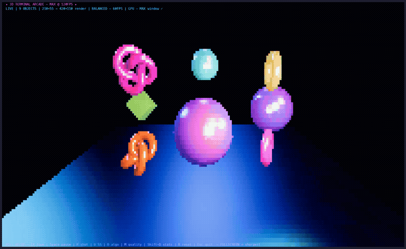

# 3D Terminal Arcade

> A neon 3×3 arcade wall rendered with **real Three.js geometry**, perspective projection, and WebGPU lighting — directly inside a terminal framebuffer via [OpenTUI](https://github.com/anomalyco/opencode).




`src/index.ts` builds a `THREE.Scene` with a perspective camera, Phong-shaded meshes (TorusKnot, Dodecahedron, Torus, Box, Icosahedron, and more in MAX), a checkerboard depth plane, and up to 6 lights (Ambient + Directionals + orbiting PointLights). Everything is rasterized by `ThreeCliRenderer` into a `FrameBufferRenderable` and converted to terminal glyphs. Yes, it's definitely 3D.

## Features

- **True 3D in the terminal** — `PerspectiveCamera` + depth, not ASCII tricks
- **WebGPU via `bun-webgpu`** — `ThreeCliRenderer.init()` awaited explicitly with fallback to `TextRenderable` on failure
- **Animated objects** — distinct `MeshPhongMaterial` per mesh (high `shininess`, white specular), auto-rotating + bobbing, with an orbiting point light
- **Quality profiles** — `LOW` / `BALANCED` / `MAX` (see below); `MAX` adds 16 objects, 120 FPS, ACES tone mapping, PCF soft shadows
- **Supersampling** — `U` cycles `NONE → CPU 2× → GPU 2× → ULTRA` (ULTRA needs the local `opentui` fork); `O` toggles `STANDARD ↔ PRE_SQUEEZED`
- **Adaptive small terminals** — wall scale, camera distance, and FOV shrink automatically below the `80×24` design target so the whole wall stays framed
- **Responsive** — adapts to terminal resizes via `engine.setSize` + `camera.aspect = engine.aspectRatio`
- **PNG export** — captures the WebGPU scene _before_ glyph conversion (`P` → `screenshots/`)

## Quality Profiles

| Profile    | FPS | Supersample | Shadows | Tone mapping               | Lights | Meshes     | Tessellation |
| ---------- | --- | ----------- | ------- | -------------------------- | ------ | ---------- | ------------ |
| `LOW`      | 30  | `NONE` 1×   | off     | `NoToneMapping` + Linear   | 2      | 5          | low          |
| `BALANCED` | 60  | `GPU` 2×    | on      | `ACESFilmic` 1.05 + sRGB   | 6      | 9          | medium       |
| `MAX`      | 120 | `GPU` 2×    | on      | `ACESFilmic` 1.18 + sRGB   | 6      | 16 + fog   | ultra        |

Select at startup (full effect, including geometry):

```sh
bun run dev:low        # weak iGPU — SS NONE, no shadows, 2 lights, 5 meshes, 30 FPS
bun run dev            # balanced default (60 FPS, 9 objects)
bun run dev:max        # M3 Pro — 16 objects, 120 FPS, ACES, shadows
```

Equivalents: `bun src/index.ts --low` / `--quality=low|balanced|max`, or env `ARCADE_QUALITY=low` / `LOW_POWER=1`.

Press `M` while running to cycle `LOW → BALANCED → MAX` live (SS / FPS / shadows / tone mapping / light visibility switch immediately; mesh count and tessellation from startup are kept, hidden extras are toggled by visibility — restart with the flag for the full geometry swap).

## Tech Stack

| Package          | Version   | Role                                                  |
| ---------------- | --------- | ----------------------------------------------------- |
| `three`          | `0.177.0` | Scene, camera, geometries, `MeshPhongMaterial`        |
| `@opentui/core`  | `^0.5.10` | `CliRenderer`, `FrameBufferRenderable`, input         |
| `@opentui/three` | `^0.5.10` | `ThreeCliRenderer`, `SuperSampleType`, `TextureUtils` |
| `bun-webgpu`     | `0.1.7`   | WebGPU binding for Bun                                |
| `jimp`           | `^1.6.0`  | PNG save via `engine.saveToFile()`                    |

## Requirements

- **Bun >= 1.3**
- **WebGPU-capable system** (macOS Metal, Windows DirectX 12, or Linux Vulkan)
- **True-color terminal** (Ghostty, Kitty, iTerm2, WezTerm, etc.)

> No WebGPU? The app shows a fallback message instead of a black screen (`src/index.ts:141-146`).

## Quick Start

```sh
bun install
bun run dev   # alias for bun src/index.ts
```

Other scripts:

```sh
bun run dev:low    # LOW profile (weak iGPU)
bun run dev:max    # MAX profile (M3 Pro)
bun run typecheck  # tsc --noEmit --skipLibCheck
bun run build      # bun build → dist/index.js
```

## Controls

| Key                   | Action                                              |
| --------------------- | --------------------------------------------------- |
| `W` / `S` / `↑` / `↓` | Move camera up / down                               |
| `A` / `D` / `←` / `→` | Orbit yaw −/+ 0.18 rad (primary)                    |
| `Q` / `E`             | Orbit yaw −/+ 0.12 rad (fine)                       |
| `Z` / `X`             | Dolly in / out                                      |
| `Space`               | Pause / resume animation                            |
| `R`                   | Reset camera                                        |
| `U`                   | Cycle supersampling (`NONE → CPU → GPU → ULTRA`)    |
| `O`                   | Toggle supersample algorithm (`STANDARD ↔ PRE_SQUEEZED`) |
| `M`                   | Cycle quality (`LOW → BALANCED → MAX`)              |
| `Shift+D`             | Toggle WebGPU render stats (Render / Readback / SS ms) |
| `P`                   | Save PNG to `screenshots/arcade-max-<timestamp>.png` |
| `Esc` / `Ctrl+C`      | Exit                                                |

Status bar shows `LIVE / PAUSED | <OBJECTS> | <term> → <render> | <quality> | <SS mode>` and controls are pinned to the bottom row. On laggy machines: switch to `LOW` (or press `M`) and check `Shift+D` — `Total Draw` should stay under ~25 ms; shrinking the terminal also halves the render pixels.

## Screenshot

Press `P` while running. Output is written via `engine.saveToFile()` to the local `screenshots/` directory (gitignored). The PNG captures the raw WebGPU framebuffer — Phong highlights, depth, and lighting — before terminal glyph conversion.

## How It Works

```
CliRenderer (full-terminal, 30/60/120 FPS by profile)
  ├─ TextRenderable: title / status / controls (zIndex 30)
  └─ FrameBufferRenderable (zIndex 10, full width/height)
       └─ ThreeCliRenderer.drawScene(scene, frameBuffer, delta)
            ├─ Scene: background #030014, checkerboard floor (128/256/512 by profile)
            ├─ Camera: PerspectiveCamera 55-72° (widens on tiny terminals), at (0,2,6)
            ├─ Lights: Ambient + Directionals + up to 3 orbiting PointLights (2 in LOW)
            └─ Meshes: 5/9/16 × MeshPhongMaterial, auto-rotating + bobbing + auto-orbit
```

- **Explicit engine path**: `new ThreeCliRenderer(...)` with `autoResize: false` and `focalLength: 8` — size is driven manually on resize for correct aspect (`camera.aspect = engine.aspectRatio`).
- **Animation loop**: `renderer.setFrameCallback` drives rotation, vertical bob, point-light orbits, and auto-yaw (slower in LOW so input stays responsive).
- **De-noised supersampling**: quadrant blocks whose 4 texels are close (`maxDist < 0.02`) collapse to a single averaged solid instead of dithering — kills the black/grey speckles inside smooth specular gradients. Patched in the local `opentui` fork (`packages/three/src/shaders/supersampling.wgsl`, `packages/native/src/buffer.zig` for the CPU path).
- **ULTRA mode**: the local fork adds `SuperSampleType.ULTRA` (`packages/three/src/WGPURenderer.ts`, `canvas.ts`) — toggle with `U`. Stock `@opentui/three` has only `NONE/CPU/GPU`.
- **Cleanup**: `destroy()` disposes geometries/materials/textures and removes the framebuffer.

## Project Structure

```
three-terminal-showcase/
├── src/index.ts        # All scene, renderer, input, and lifecycle logic
├── assets/demo.png     # Demo screenshot (used in this README)
├── screenshots/        # Runtime PNG exports (gitignored)
├── package.json        # Bun + WebGPU + Three.js deps
└── tsconfig.json       # ESNext / bundler / strict
```

## License

AGPL-3.0-or-later — see [LICENSE](LICENSE).
